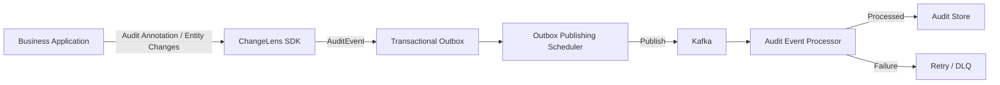
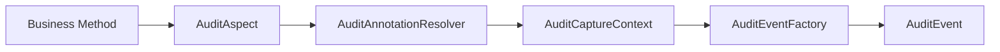
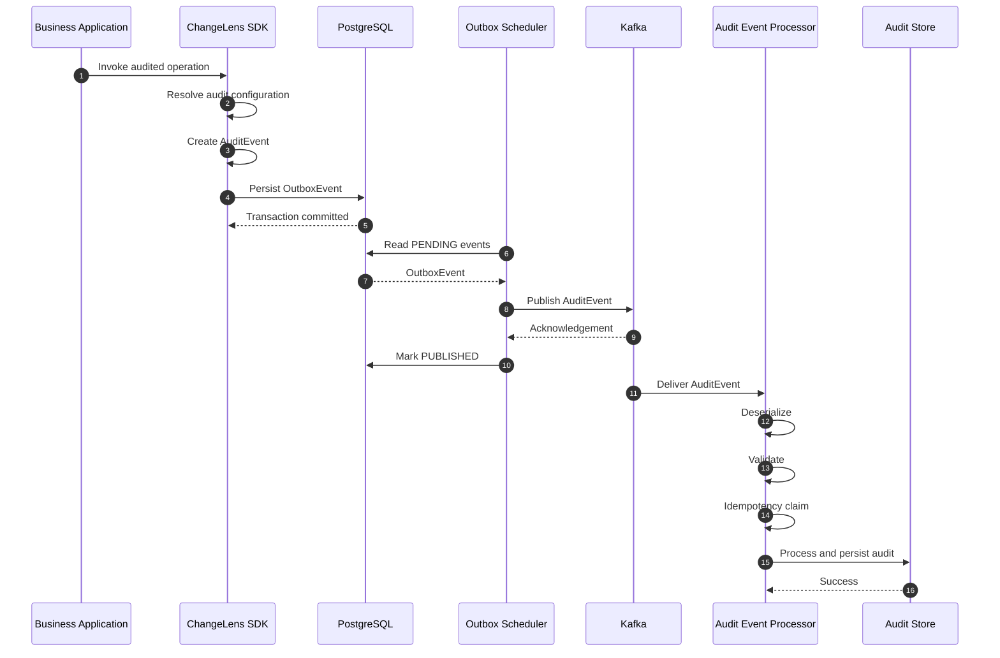
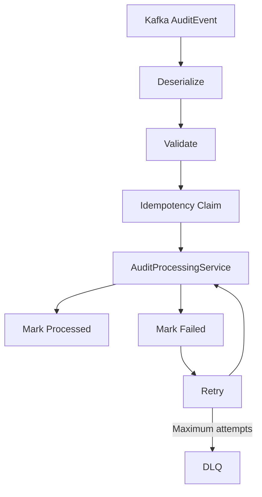
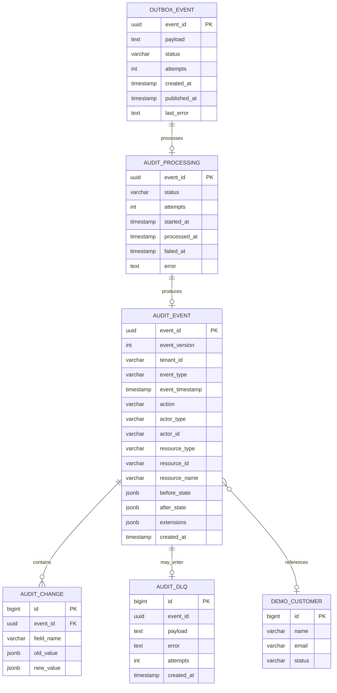

# ChangeLens — Stage 7: MVP Finalization & Demo Readiness

## Overview

Stage 7 is the final consolidation stage of the ChangeLens MVP.

The objective is to bring together the auditing SDK, event-driven processing pipeline, integration tests, architecture documentation, and demonstration material into a coherent MVP that can be reviewed and demonstrated end-to-end.

> **The application declares what should be audited; ChangeLens owns the audit event lifecycle.**

## 1. Stage 7 Objectives

- Finalize the ChangeLens MVP architecture.
- Validate the end-to-end audit event lifecycle.
- Demonstrate method-level auditing.
- Demonstrate class-level auditing.
- Demonstrate entity / field-level auditing.
- Validate the Transactional Outbox flow.
- Validate asynchronous Kafka processing.
- Validate idempotent audit processing.
- Validate processing status tracking.
- Validate retry and DLQ foundations.
- Document the architecture with UML, sequence, activity, and ER diagrams.
- Provide reproducible integration-test commands.
- Prepare the project for the final hackathon demonstration.

## 2. MVP Architecture



## 3. Audit Capture

The ChangeLens SDK uses Spring AOP to intercept audited application operations.



### Method-level auditing

```java
@Audit(
    action = "CREATE",
    resource = "CUSTOMER"
)
public DemoCustomer createCustomer(...) {
    ...
}
```

### Class-level auditing

```java
@Audit(
    action = "UPDATE",
    resource = "CUSTOMER"
)
public class DemoCustomerService {
    ...
}
```

### Entity / field-level auditing

The audit event model supports:

```text
beforeState
afterState
fieldChanges
```

For example:

```text
name:
    Abhishek -> Abhishek Gupta

email:
    abhishek@example.com -> abhishek.gupta@example.com

status:
    ACTIVE -> PREMIUM
```

## 4. End-to-End Event Lifecycle



## 5. Processing and Idempotency



The processor distinguishes between:

```text
STARTED
RETRY_STARTED
ALREADY_PROCESSED
ALREADY_PROCESSING
MAX_ATTEMPTS_REACHED
```

## 6. Persistence Model

Core MVP tables:

```text
audit_event
audit_processing
audit_change
audit_dlq
outbox_event
demo_customer
flyway_schema_history
```

### ER Diagram



`resource_id` is audit metadata rather than a hard database foreign key because ChangeLens is intended to audit arbitrary application resources.

## 7. Demonstrated MVP Capabilities

### 7.1 Method-Level Auditing

Test:

```text
shouldAuditCustomerCreation
```

Run:

```bash
mvn -Dtest=DemoProductIntegrationTest#shouldAuditCustomerCreation test
```

Expected flow:

```text
createCustomer()
    ↓
AuditAspect
    ↓
AuditEvent
    ↓
OutboxEvent
    ↓
PUBLISHED
    ↓
Kafka
    ↓
AuditProcessing
    ↓
PROCESSED
    ↓
audit_event
```

### 7.2 Class-Level Auditing

Test:

```text
shouldUseClassLevelAuditConfiguration
```

Run:

```bash
mvn -Dtest=DemoProductIntegrationTest#shouldUseClassLevelAuditConfiguration test
```

Expected result:

```text
Action   = UPDATE
Resource = CUSTOMER
Status   = PROCESSED
```

### 7.3 Entity / Field-Level Auditing

Test:

```text
shouldCaptureEntityFieldChanges
```

Run:

```bash
mvn -Dtest=DemoProductIntegrationTest#shouldCaptureEntityFieldChanges test
```

The scenario changes:

```text
Abhishek -> Abhishek Gupta
abhishek@example.com -> abhishek.gupta@example.com
ACTIVE -> PREMIUM
```

The architecture supports `beforeState`, `afterState`, and `fieldChanges`.

> **MVP boundary:** generic automatic entity state capture and field-diff generation remains a refinement area.

## 8. Test Infrastructure

The integration tests exercise the configured infrastructure:

```text
PostgreSQL
Kafka
Redis
Spring Boot Application
```

The intended test path is:

```text
Application
    ↓
SDK
    ↓
PostgreSQL Outbox
    ↓
Kafka
    ↓
Processing
    ↓
PostgreSQL Audit Store
```

## 9. Validation Commands

Run the three MVP demonstrations individually:

```bash
mvn -Dtest=DemoProductIntegrationTest#shouldAuditCustomerCreation test
```

```bash
mvn -Dtest=DemoProductIntegrationTest#shouldUseClassLevelAuditConfiguration test
```

```bash
mvn -Dtest=DemoProductIntegrationTest#shouldCaptureEntityFieldChanges test
```

Run the complete class:

```bash
mvn -Dtest=DemoProductIntegrationTest test
```

## 10. Database Verification

```sql
SELECT table_schema, table_name
FROM information_schema.tables
WHERE table_schema = 'public'
ORDER BY table_name;
```

```sql
SELECT *
FROM audit_event
ORDER BY event_timestamp DESC;
```

```sql
SELECT *
FROM audit_processing
ORDER BY processed_at DESC;
```

```sql
SELECT *
FROM outbox_event
ORDER BY created_at DESC;
```

```sql
SELECT *
FROM audit_change
ORDER BY id DESC;
```

## 11. Stage 7 Deliverables

### SDK

- `@Audit` annotation
- `AuditAspect`
- `AuditAnnotationResolver`
- `AuditCaptureContext`
- `AuditEventFactory`
- `AuditEventPublisher`
- Standardized `AuditEvent`

### Event Infrastructure

- Transactional Outbox
- Outbox publishing scheduler
- Kafka producer
- Kafka consumer
- Audit event processor
- Idempotency handling
- Retry handling
- DLQ foundation

### Persistence

- `audit_event`
- `audit_processing`
- `audit_change`
- `audit_dlq`
- `outbox_event`

### Demo Application

- `DemoCustomer`
- `DemoCustomerService`
- Method-level audit demonstration
- Class-level audit demonstration
- Entity / field-level audit demonstration

### Tests

- `shouldAuditCustomerCreation`
- `shouldUseClassLevelAuditConfiguration`
- `shouldCaptureEntityFieldChanges`

### Documentation

- MVP architecture README
- Testing guide
- UML diagrams
- Sequence diagrams
- Activity diagrams
- ER diagram
- Demo presentation material

## 12. Current MVP Boundary

The Stage 7 implementation establishes the core audit event pipeline and demonstrates the three auditing concepts.

```text
             CHANGE LENS MVP
                   |
        +----------+----------+
        |                     |
   Audit Capture          Event Pipeline
        |                     |
   Method Audit          Transactional Outbox
   Class Audit           Kafka
   Entity Audit          Idempotency
        |                Processing
        |                Retry / DLQ
        |                     |
        +----------+----------+
                   |
              Audit Store
```

The entity/field-level model is established, while fully generic automatic entity state capture and field-diff generation is a subsequent refinement.

## 13. Future Evolution

- Generic entity state capture
- Robust field-level diff generation
- Audit query APIs
- Change Log dashboard
- Advanced filtering and search
- Tenant-aware audit access
- Audit retention policies
- Operational monitoring
- Metrics and observability
- Additional integrations

## 14. Final Architectural Principle

```text
Application
    |
    | declares audit intent
    v
ChangeLens SDK
    |
    | creates standardized AuditEvent
    v
Transactional Outbox
    |
    | reliable asynchronous publication
    v
Kafka
    |
    | event transport
    v
Audit Processing
    |
    | idempotency + processing + retry
    v
Audit Store
```

The application only needs to express audit intent:

```java
@Audit(
    action = "CREATE",
    resource = "CUSTOMER"
)
```

ChangeLens owns the rest of the audit lifecycle.
